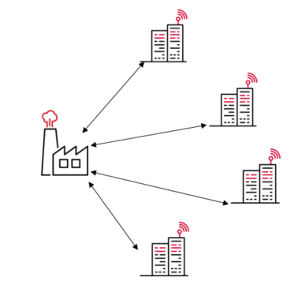
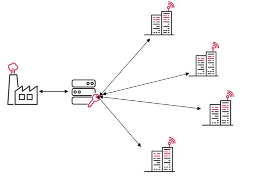

---?color=linear-gradient(100deg, #cf022b 50%, white 50%)

@snap[west span-40 text-center]
### Jira Integration Server
* Siam for Jira Servicedesk *

@snapend

@snap[east span-40 text-center]

@snapend

---

## Background

 When XXX switched from [Put in SD vendor here] to [Put in SD vendor here] every integration needed to be rewritten
 - Both on their side 
 - And for the suppliers/vendors/customers 

---

@snap[west span-40 text-center]

### Before

@snapend

@snap[east span-40 text-center]
 
 - Integrations were directly coupled to the named servicedesk
 - Developed over the years by whoever was responsible/available at the time

@snapend
---

@snap[west span-40 text-center]

### Before

@snapend

@snap[east span-40 text-center]
### After

@snapend

